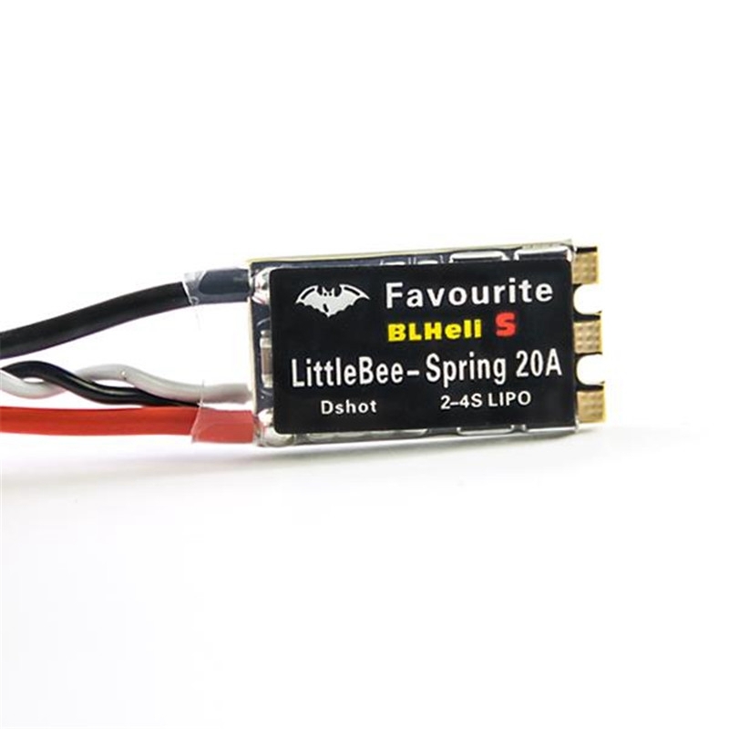
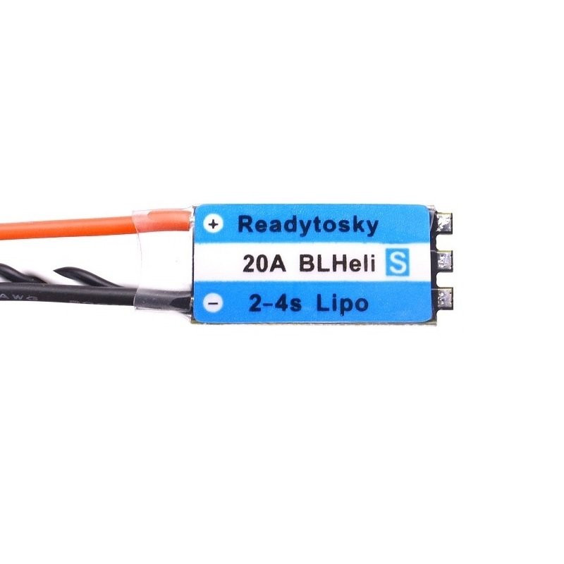
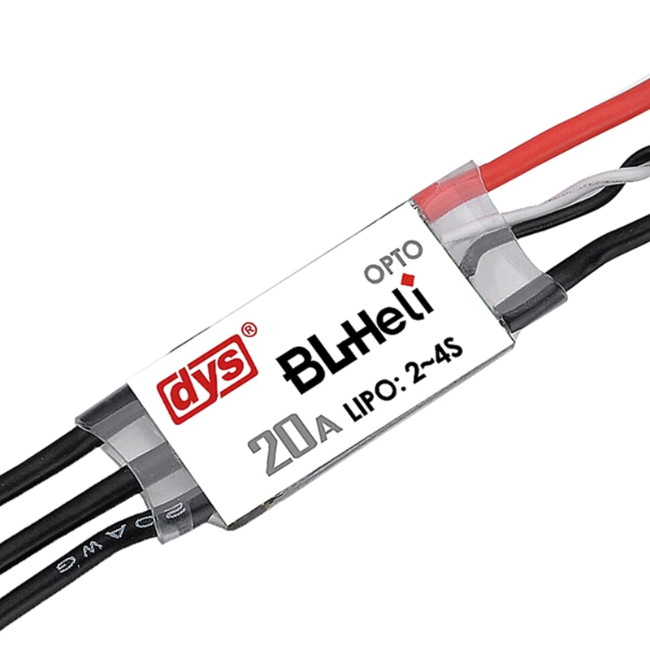
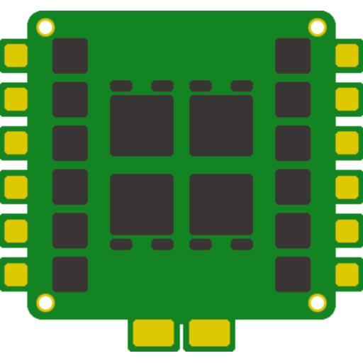
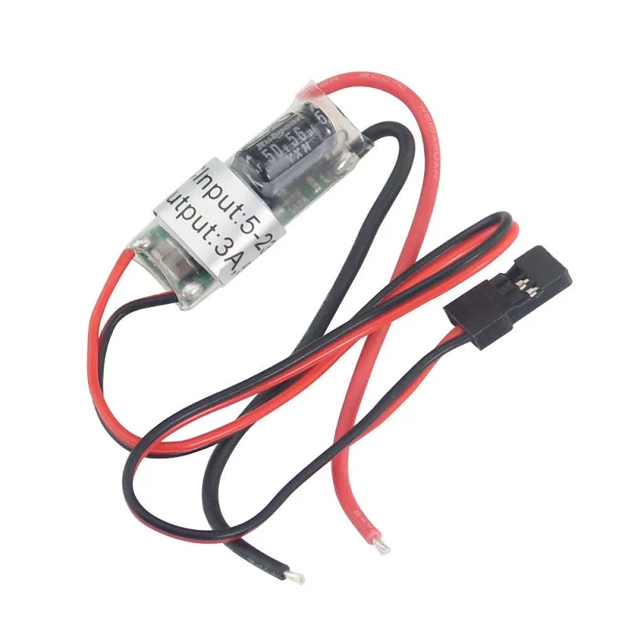
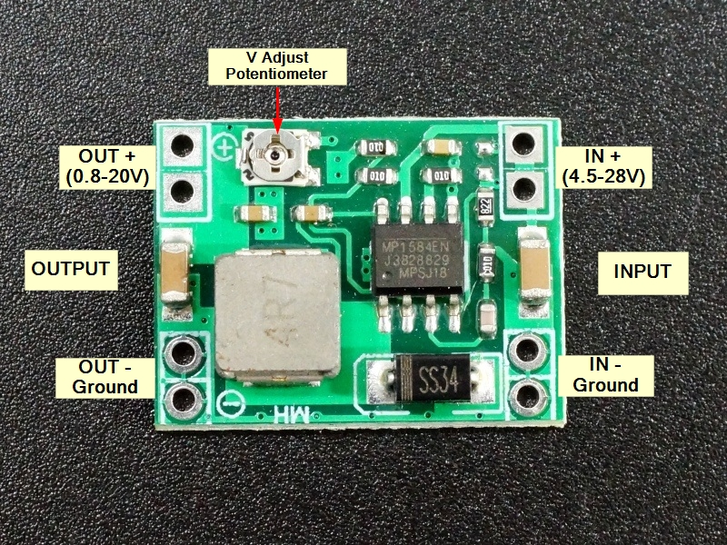

# Blheli_S ESC
{: style="height:200px"}
{: style="height:200px"}
{: style="height:160px"} 

## Why Blheli_S ESC?

### Advantages
* Better **Low RPM** performance
* Relatively **cheap** for driving BLDC motors
* **Compact and Lightweight**
* **Easily configurable** with esc-configurator
* Wide range of hardware available

### Disadvantages
* They don't have **inbuilt BEC**
* Requires a **Flight controller or Arduino** for configuration

## How to configure Blheli_S?
Blheli_S esc can be configured using 
{: style="height:30px"} 
**[ESC-configurator](https://esc-configurator.com)**

### Additional hardware required
Arduino (UNO or Nano) or Flight controller can be used as programmer

1. **Flight controller** - works directly with ***betaflight*** firmware, no additional flashing required
2. **Arduino guide** - [use Arduino as *ESC programmer*](https://youtu.be/i6lhMcQLRSU)

## Firmware settings
Since Blheli_S was originally designed for Quads and Helis, we have to change some settings before using them in our models

* **Motor direction** - Set to ***Bi-directional*** mode
* **Startup power** - Start with a **low** value, then increase as necessary.
* **Low RPM protection** - ***Disable***
* **Demag compensation** - This is a safety feature, The ESC will cutoff power to motor if the motor is stalled. To be set to ***LOW***
* **Motor timing** - Set to **LOW**, this enables smooth low RPM performance

### Powering other electronics

Blheli_S ESC don't have inbuilt BEC like the crawler ESCs
You have to buy a BEC to power the Receiver and Servos.
Alternatively, You can also use a 5V buck convertor (less than $3).
{: style="height:300px"} 
{: style="height:200px"} 

