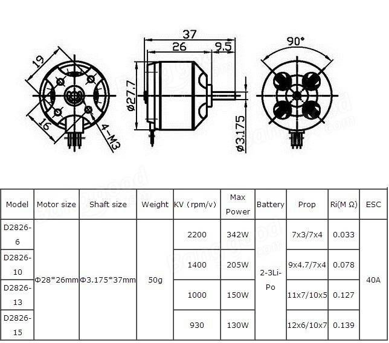

# Recommended Hardware

## 1. Motors
All of our RC scale models use **Brushless motors** (especially A2212 motor):
### A2212 Motor
Our **1/12** and **1/16** scale builds use this motor. You can buy this motor pretty much anywhere, this is the **most common brushless motor**.

The model numbers can be confusing since **2212 and 2826** are basically the **same motor**.

{: style="height:160px"}
{: style="height:160px"}

* **2212** - This is stator size of the motor (22mm diameter x 12mm height)
* **2826** - This is casing size of the motor (28mm diameter x 26mm height)

??? note "KV rating of **1000-1400** is preferred"
       Higher KV will also work fine, but limit the throttle to avoid melting the gears.
{: style="height:250px"}
{: style="height:200px"}

### 1104 Motor
Our smaller builds like **1/64** scale use this motor.

This runs on less than 5A current. **5-20A ESC** is suitable for this motor

{: style="height:140px"}
{: style="height:160px"}
{: style="height:180px"}

## 2. ESC
A suitable ESC would be required for the BLDC motors.
**20A ESC** would be suited for A2212 motor. Blheli_S is the preferred choice for our builds.
Read more in the [Blheli_S section.](blheli.md)
{: style="height:250px"}
{: style="height:250px"}

## 3. Servo motor
You can use any 9g servo. Even the common Blue servos will work fine.

**MG90S servo** is recommeded, they have metal gears and work smoothly.

{: style="height:250px"}
{: style="height:200px"} 

## 4. Battery
Li-Ion, Li-Po batteries are recommended for our builds.

??? note
	Lithium batteries require a dedicated balance charger for safe operation.

## 5. TX & RX

### Choosing a Transmitter
Any Transmitter and Receiver will work well with our models, it needs be chosen as per your preferences. So what to look for when choosing a transmitter:

* **Number of channels** - 6 would be a good start, better to have more than falling short
* **Receiver output** -	PWM output is required
* **Form factor** - air & surface radios, air type radio is more versatile since it can be used for surface vehicles also

### What I use
1) **Flysky i6S**, I bought this in 2017. It is still working great.

2) **Radiomaster Zorro**, probably overkill. Has tons of features

{: style="height:250px"}
{: style="height:200px"} 

